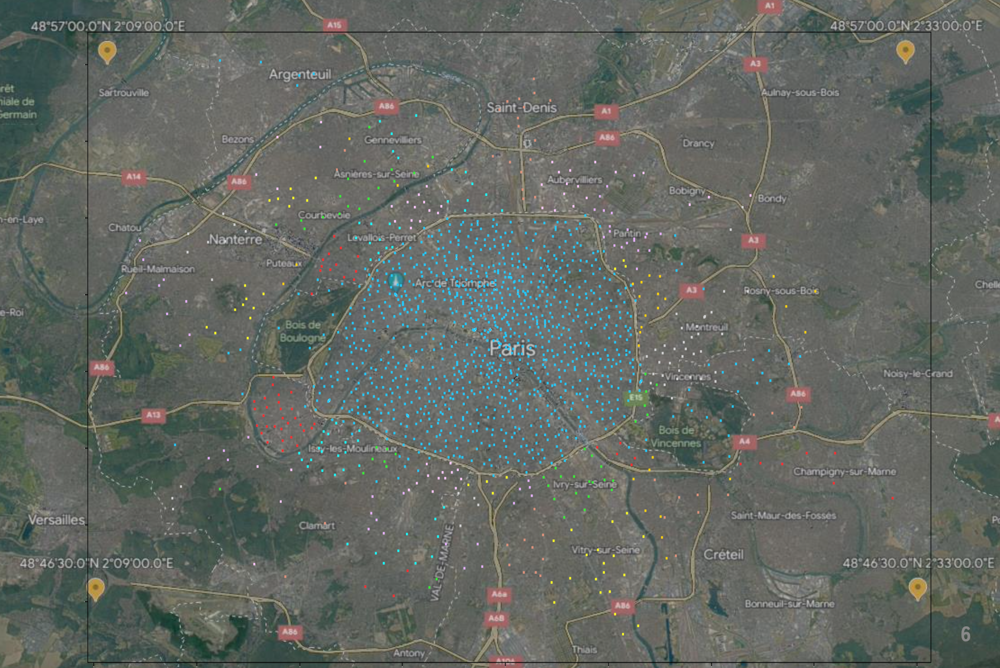

# TIPE

## Français (English below)

Voici mon projet de TIPE pour mon parcourt en classe préparatoire aux grandes écoles.  
Le thème de mon année est : **La ville**.

J'ai choisi de m'intéresser aux algorithmes de prédiction et leurs applications dans le réseau Vélib'.

### But

Afin d'éviter de se retrouver dans la cas d'une station vide ou parfaitement pleine, mon but est de prévoir l'occupation des stations du réseau Vélib'.

Chaque point représente une station et les couleurs illustrent les communes de la région parisienne.

### Exécution

Je récupère les données historiques du réseau grâce à l'API du site <a href="https://opendata.paris.fr">opendata.paris.fr</a>
et les données météo grâce au site <a href= "https://www.visualcrossing.com">visualcrossing.com</a>.
J'ai fait tourner [GET_csv.py](GET_csv.py) sur 3 mois. Le fichier n'est pas sur le git (4,5Go), mais j'ai fourni [un jour de recupération](vélib_données.csv) pour comprendre le format.

J'ai utilisé 3 modèles de prédiction différents :

- **1er modèle** : modèle naïf, des moyennes temporelles
- **2ème modèle** : clustering
- **3ème modèle** : Random Forest

Ces modèles sont inspirés de ceux utilisés dans differentes études, vous pouvez retrouver les références des articles dans mon [MCOT](MCOT_DOT/Mcot_40599.pdf)

En raison de la longueur des calculs, les résultats ont été stockés dans des fichiers Numpy (`.npy`), ils sont retrouvables dans le répertoire [resultats](resultats).  
De plus, pour réduire le temps de calcul, j'ai eu recours au  [_multiprocessing_](multiprocess.py). Les différents scripts qui ont servis aux differents calculs sont laissé en commentaires dans le fichier python.

Pour plus de détails sur les modèles, voir [ici](modeles.md).

---

### Récapitulatif des fichiers et répertoires

Les fichiers:

- `Main.py` : Le fichier principal, il est décomposé en deux parties :  
    - I) La prédiction sur les places disponibles  
    - II) la prédiction sur les vélos disponibles.  
    Chaque partie est décomposée en trois sous parties representant les trois modèles utilisés.  
Il reste les fonctions d'affichage qui utilisent `matplotlib`.
La manipulation des fichiers `csv` est faite avec le module `Pandas`.
- `Aux_.py` : les fonctions auxiliaires, utiles pour `Main` mais qui ne sont pas propres au raisonnement des differents modèles.
- `GET_csv.py` : le script permettant de récuperer les données de l'API Vélib` de <a href="https://opendata.paris.fr">opendata.paris.fr</a>
- `traitement.py` : les differentes fonctions de traitement des données. Ce traitement est nécessaire pour préparer les données aux modèles de prédiction.
- `multiprocess.py` : les scripts de _multiprocessing_ qui ont permis de réduire les temps de calcul.
- `vélib_données.csv` : un exemple de table de données utilisable dans les différents modèles.

Les répertoires :

- `resultats` : les fichiers `.npy` des résultats des différents modèles.
- `npyAuxiliaires` : des fichiers `.npy` utiles dans des fonctions, comme les passages `Nom de station` à `Code de station`.
- `grilles` : les fichiers `.npy` qui stockent les grilles utiles dans le modèles de _clustering_.
- `csvAux` : des fichiers `.csv` utiles comme un fichier de référence, un fichier pour les coordonnées géographiques, le fichier de sortie pour le _random forest_.
- `MCOT_DOT` : Mon MCOT et mon DOT, les livrables du TIPE.
- `illustrations` : répertoire contenant les illustrations des différents `.md`

---
---

## English

Here is my TIPE project for my studies in preparing classes for high schools.
My year theme was : **The city**

I chose to focus on predictive algorithms and their applications in the Vélib' network.

### Goals

In order to avoid be be in the situation were a station is empty or complety full, my goal is to predict every station's occupancy.

Each dot represents a station and the colors show the municipalities of the Paris region.

### Execution

I get the historical data from the network through the <a href="https://opendata.paris.fr">opendata.paris.fr</a> website API and the weather data through <a href= "https://www.visualcrossing.com">visualcrossing.com</a>. I ran [GET_csv.py](GET_csv.py) for 3 months. The file is not on git (4.5GB), but I provided [a day of recovery](vélib_données.csv) to understand the format.

I used three different predictive models:

- 1st model: naive model, temporal averages
- 2nd model: clustering
- 3rd model: _Random Forest_

These models are inspired by those used in different studies, you can find the references of the articles in my [MCOT](MCOT_DOT/Mcot_40599.pdf).

Due to the length of the calculations, the results have been stored in Numpy (.npy) files, they can be found in the [resultats](resultats) directory.
In addition, to reduce the calculation time, I used [_multiprocessing_](multiprocess.py). The various scripts used for the different calculations are left as comments in the python file.

For more details on the models, see [here](modeles.md). _(in french only)_

---

### Summary of files and directories

The files:

- `Main.py` : The main file, it is broken down into two parts: I) Prediction on available places II) Prediction on available bikes. Each part is divided into three sub-parts representing the three models used. There are still display functions that use matplotlib. Handling csv files is done with the Pandas module.
- `Aux_.py` : auxiliary functions, useful for Main but not specific to the reasoning of the different models.
- `GET_csv.py` : the script for retrieving data from the Vélib API from opendata.paris.fr
- `processing.py` : the various data processing functions. This processing is necessary to prepare the data for prediction models.
- `multiprocess.py` : Multiprocessing scripts that have reduced compute times.
- `vélib_données.csv` : an example of a data table that can be used in different models.

The directories:

- `results` : the `.npy` files of the results of the different models.
- `npyAuxiliaires` : Useful `.npy` files in functions such as Station Name to Station Code.
- `grids` : the `.npy` files that store useful grids in the clustering templates.
- `csvAux` : files `.csv` useful as a reference file, a file for geographical coordinates, the output file for the random forest.
- `MCOT_DOT` : My MCOT and DOT, the TIPE deliverables.
- `illustrations` : directory containing illustrations of different `.md`
