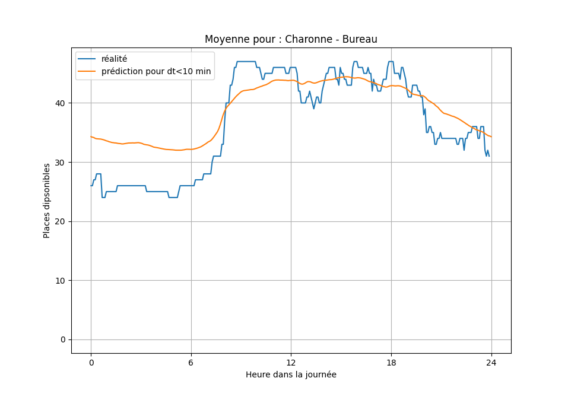
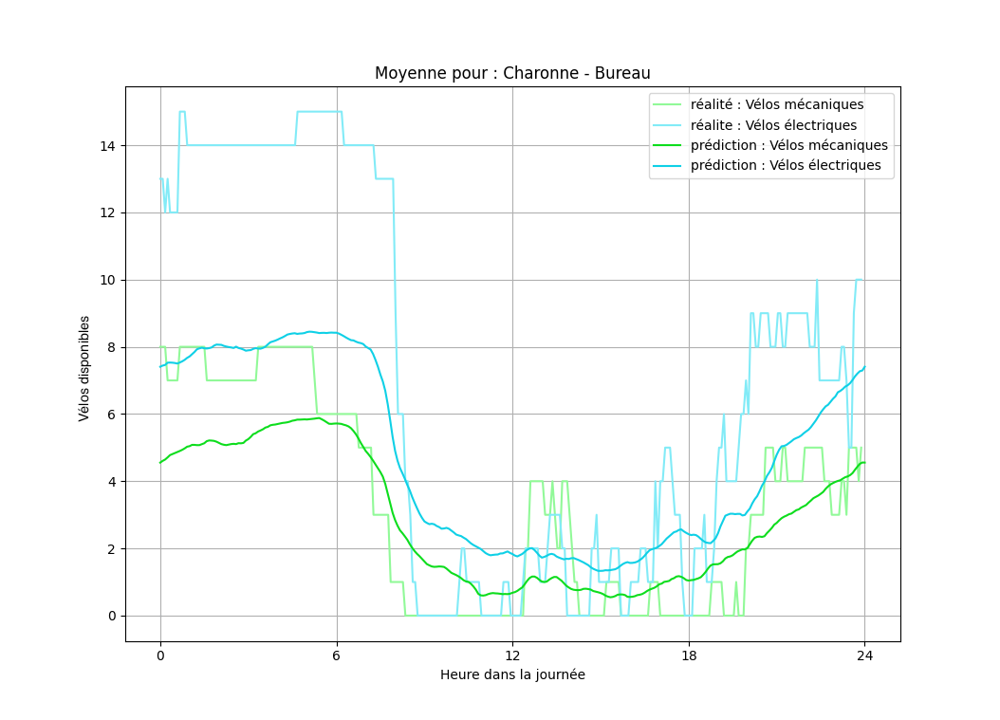
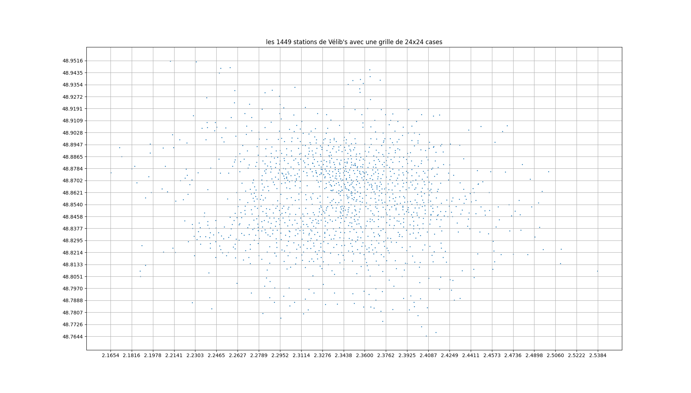
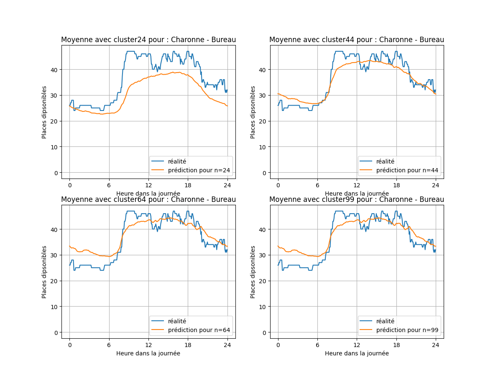
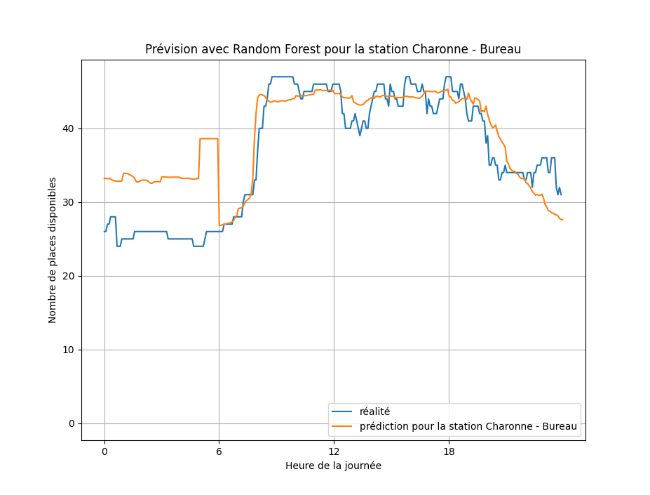
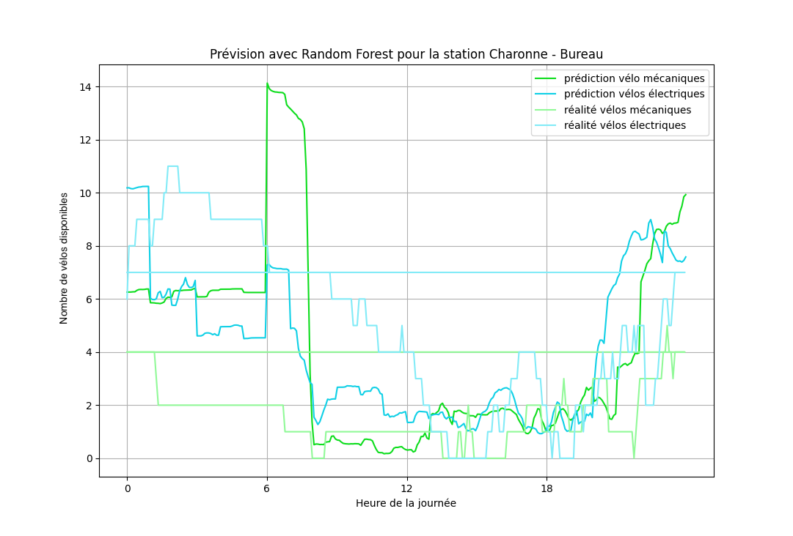
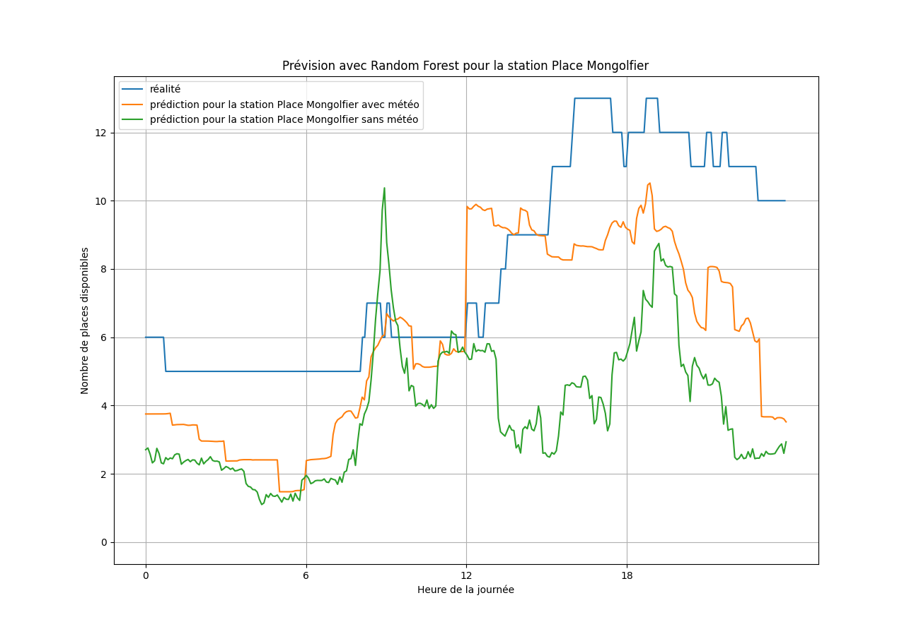

# Explications des modèles de prédiction utilisés

## 1er modèle

Ici, on utilise l'idée la plus naïve, on va faire des moyennes temporelles.  
Je dois donc définir un intervalle de temps sur lequel faire les moyennes.  
Et ainsi, je fais la moyenne.  

En notant respectivement :

- $x_{s,\tau,dispo}$, $x_{s,\tau,meca}$, $x_{s,\tau,elec}$ les nombres de places, vélos mécaniques  
et vélos éléctriques disponibles à la station $s$ à l'instant $\tau$ 

$$\text{Moy}_{s,t,i } = \frac{ \sum_{ \tau \in [t- \Delta t;t+ \Delta t]} x_{s,\tau,i} }{ \text{Card} \{d_{s,\tau} | \tau \in [t- \Delta t;t+ \Delta t] \} } \qquad i \in \{\text{dispo, meca, elec} \}$$

\[\text{Moy}_{s,t,i } = \frac{ \sum_{ \tau \in [t- \Delta t;t+ \Delta t]} x_{s,\tau,i} }{ \text{Card} \{d_{s,\tau} | \tau \in [t- \Delta t;t+ \Delta t] \} } \qquad i \in \{\text{dispo, meca, elec} \}\]

Autrement dit : 
$ \text{Moy}_{s,t,i } = \text{Moyenne} ( \: \{x_{s,\tau,i} | \tau \in [t- \Delta t;t+ \Delta t] \} \: ) \qquad i \in \{\text{dispo, meca, elec} \} $

  

---

## 2ème modèle

On fait l'hypothése que dans un groupe les stations se comportent de la même manière.  
On veut faire des clusters de stations. Je découpe donc la région parisienne avec un quadrillage.  

et ensuite je définis par analogie à l'article de recherches dans lequel ils utilisent le taux de check-in et check-out, le taux d'occupation, en notant :  

- $G$ un groupe de stations  
- $S_G$ l'ensemble des stations de $G$  

$$ \theta_{G,t,\text{i}} = \frac{ \sum_{s \in S_G} \text{MoyCib}_{s,t,\text{i} } }{ \sum_{s \in S_G} \text{Capacité de s} } \qquad i \in \{\text{dispo, meca, elec} \}$$

Autrement dit : je fais le rapport entre les places disponibles dans le groupe et le total des places du groupe.

Et ainsi, pour obtenir la valeur prédite pour une station :  
$$ Y_{s,t,\text{i}} = C_s \times \theta_{G_s,\text{i}} \qquad i \in \{\text{dispo, meca, elec} \}$$
On obtient le résultat par proportionnalité.

On répète ainsi l'opération pour chaque point $t$ voulu.

---

## 3ème modèle

Je vais utiliser l'algorithme de Random Forest en régression. J'utilise les fonctions mises à disposition par la bibliothèque `sklearn` et plus particulièrement de `sklearn.ensemble`

Je ne vais pas détailler le fonctionnement de l'algorithme ici.

Grâce à cet algorithme je peux ajouter des facteurs externes à la prédiction comme la météo. J'ai choisit de prendre en compte la température, les précipitations, la vitesse du vent et les conditions générales.  
Ainsi, en mettant en entrée une table de données de la forme de `vélib_données.csv` et comme table de sortie un fichier de la forme `vélib_données_16mai.csv` disponible dans `csvAux`. On obtient les résultats suivant :

 

On peut ci-dessous observer l'influence de la météo sur le modèle utilisant le _Random Forest_, on voit que le matin (00h-06h) la météo influe peu sur le modèle, en revanche l'après midi, (12h-18h) la météo à une grande importance. Ceci semble montrer une cohérence du modèle.

